<!-- ═══════════════════════════════════════════════════════════════════
     PHASE 1 — ANIMATED BANNER
     dark.svg = dark mode  |  light.svg = light mode
     Both are generated by banner/generate_banner.py
     ═══════════════════════════════════════════════════════════════════ -->

<picture>
  <source media="(prefers-color-scheme: dark)"  srcset="banner/dark.svg">
  <source media="(prefers-color-scheme: light)" srcset="banner/light.svg">
  
</picture>

  

<!-- ═══════════════════════════════════════════════════════════════════
     PHASE 2 — STATS CARDS
     Self-host via Vercel for reliable API.  See SETUP.md for steps.
     Replace YOUR_VERCEL_URL with your deployed instance URL once live.
     Until then, the public instance below will work but may rate-limit.

     Why hide_rank=true?
     The rank badge is weighted by GitHub stars.  Stars accumulate slowly
     for newer accounts no matter how active you are — hiding it keeps the
     card honest and focussed on actual contribution volume.
     ═══════════════════════════════════════════════════════════════════ -->

<!-- STREAK — full width -->

 

<!-- STATS + TOP LANGS — side by side -->
&nbsp;

  

<!-- ═══════════════════════════════════════════════════════════════════
     PHASE 3 — CONTRIBUTION SNAKE
     The snake SVGs are pushed to the 'output' branch by the GitHub
     Action in .github/workflows/snake.yml.
     IMPORTANT: only uncomment the <picture> block AFTER the Action has
     run green at least once — the 'output' branch does not exist before
     that and the image tag will show a broken link.
     ═══════════════════════════════════════════════════════════════════ -->

<picture>
  <source
    media="(prefers-color-scheme: dark)"
    srcset="https://raw.githubusercontent.com/pushkarrd/pushkarrd/output/github-contribution-grid-snake-dark.svg"
  />
  <source
    media="(prefers-color-scheme: light)"
    srcset="https://raw.githubusercontent.com/pushkarrd/pushkarrd/output/github-contribution-grid-snake.svg"
  />
  
</picture>

  

<!-- ═══════════════════════════════════════════════════════════════════
     PHASE 4 — SOCIAL BADGES
     Notes:
     • LinkedIn logo only renders on brand blue #0A66C2; on any other
       background colour the glyph silently disappears (shields.io bug).
       Using brand blue here intentionally.
     • GitHub badge omitted — circular / redundant on own profile.
     • &nbsp;&nbsp; gives consistent spacing between badges.
     ═══════════════════════════════════════════════════════════════════ -->

&nbsp;&nbsp;&nbsp;&nbsp;&nbsp;&nbsp;

